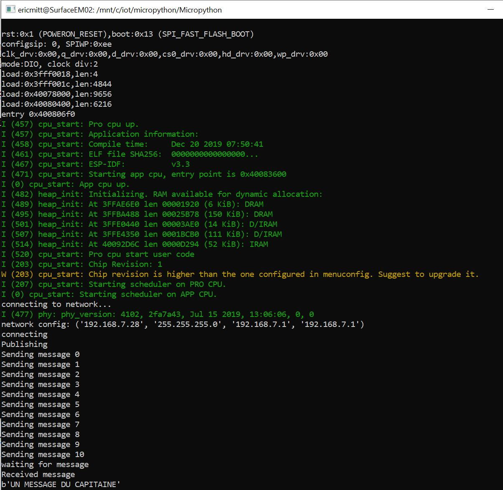

# Using MQTT to connect an IoT Hub with Micropython on ESP32

## Getting started with Micropython on an ESP32
See [this page](https://docs.micropython.org/en/latest/esp32/tutorial/intro.html) to install the ESP toolchain and Micropython on your ESP32.


## Connecting to the network
Micropython has two default files it can use automatically-- `boot.py` and `main.py`. `boot.py` will run whenever the Micropython device starts, and `main.py` will run after that. It's best to put the initial connection logic in the `boot.py` file. This info is provided in [Micropython docs](https://docs.micropython.org/en/latest/esp32/quickref.html#networking) as well. See the example below: 


```python
def do_connect():
    import network
    wlan = network.WLAN(network.STA_IF)
    wlan.active(True)
    if not wlan.isconnected():
        print('connecting to network...')
        wlan.connect('Your ssid', 'Your password')
        while not wlan.isconnected():
            pass
    print('network config:', wlan.ifconfig())
```
## Using MQTT

All samples have been coded using MQTT as protocol.
Micropython uses 2 MQTT libraries :- `umqtt.simple` and `umqtt.robust`. 
The samples have been tried using both of these mqtt libraries.
Each sample has 2 functionalities :-
* Telemetry to IoT Hub
* Receive Message from IoT Hub

First check if `umqtt` is already installed by doing `help('modules')` on the ESP 32 board. If umqtt is there you may not need the below 2 libraries.

```python
import upip
upip.install('micropython-umqtt.robust')
```
You also need to grab its dependency, micropython-umqtt.simple:
`upip.install('micropython-umqtt.simple')`

Currently the sample uses `umqtt robust` but the same sample can be written with `umqtt simple`

The code will tehn create a connection and call reconnect (in robust library, only reconnect is available)
```python
## Create UMQTT ROBUST or UMQTT SIMPLE CLIENT
mqtt_client = create_mqtt_client(client_id=device_id, hostname=hostname, username=username, password=sas_token_str, port=8883, keepalive=120, ssl=True)

print("connecting")
mqtt_client.reconnect()
```

You then be able to subscribe to MQTT topic
```python
subscribe_topic = get_c2d_topic(device_id)
mqtt_client.set_callback(callback_handler)
mqtt_client.subscribe(topic=subscribe_topic)
```

Sending the message is just a call:
```python
mqtt_client.publish(topic=topic, msg=messages[i])
```
Same waiting for a cloud to device message is just:
```python
## Send a C2D message and wait for it to arrive at the device
print("waiting for message")
mqtt_client.wait_msg()
```


## copying file to the board
Once your mai.py, boot.py and util.py file are ready to be copied.
You can use putty or rshell to connect to the board and copy file.
For this sample I used picocom (to monitor execution, interactive python etc) and rshell for copying my files.

```
sudo apt install picocom
pip install rshel
```
Navigate to your project folder, and use cp to copy files to the board (named /pyboard here)

```
cp main.py /pyboard/main.py
cp boot.py /pyboard/boot.py
cp util.py /pyboard/util.py
```

Then connect picocom to the board: ``` picocom /dev/ttyS5 -b115200```
And reset the board to (re)start execution: Push the reset button on the board.

You should see this execution trace:



## Possible Errors
In case of the following errors while trying to make a connection do the following things :-

- `MQTTException: 5` : Check password used for connection
- `List index out of range` : Check wifi connection parameters
